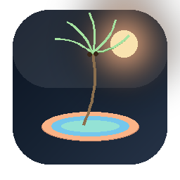
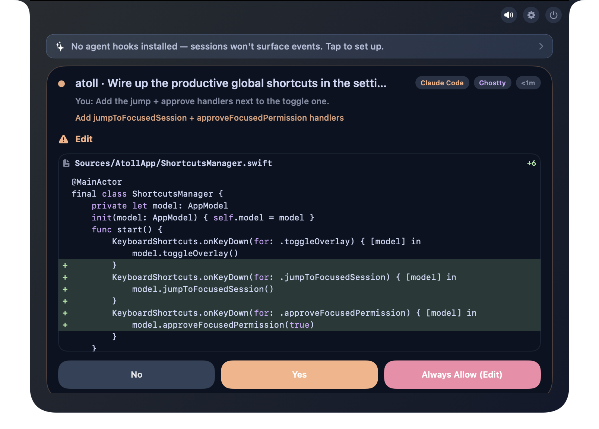
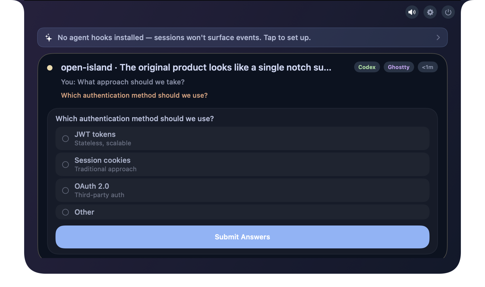
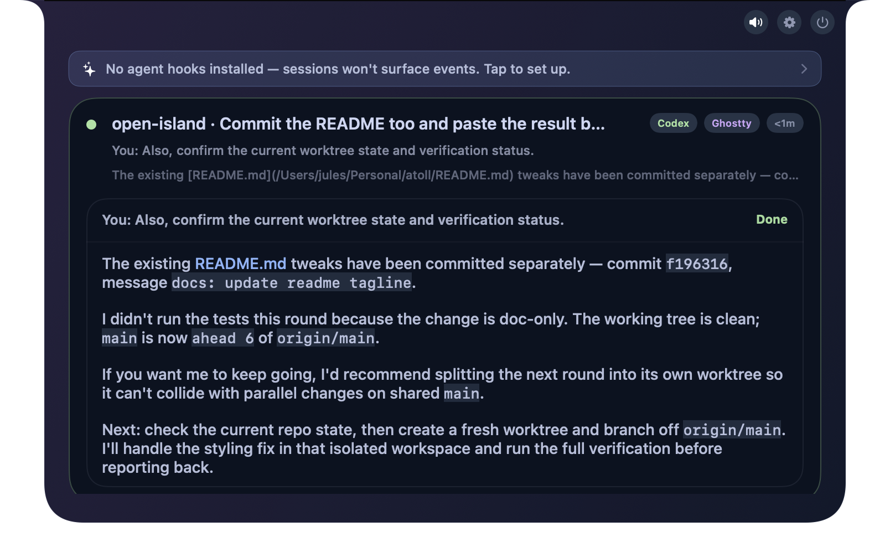
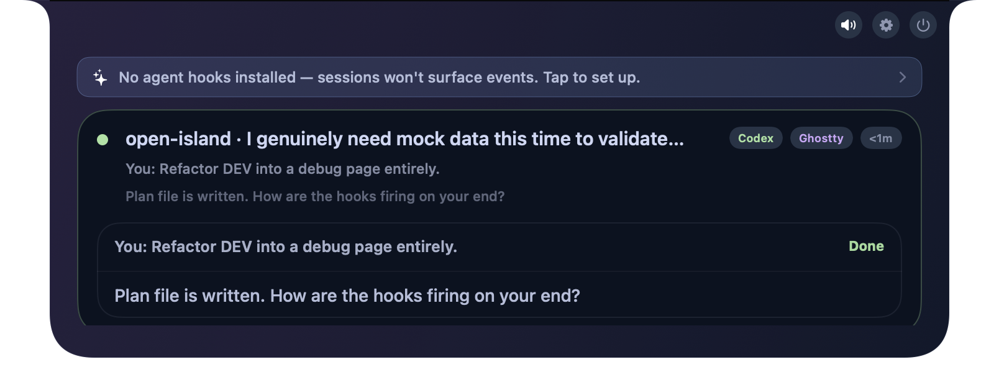

<p align="center">
  
</p>

<p align="center">
  <strong>The native macOS companion your AI coding agents deserve.</strong>
  <br>
  A themed, local-first control surface that lives in your notch and watches every agent you run.
  <br><br>
  <a href="README.zh-CN.md">中文</a> | <strong>English</strong>
</p>

<p align="center">
  <a href="https://github.com/h4ckm1n-dev/atoll/releases/latest"></a>
  <a href="https://github.com/h4ckm1n-dev/atoll/stargazers"></a>
  
  
  <a href="LICENSE"></a>
</p>

<p align="center">
  <a href="https://github.com/h4ckm1n-dev/atoll/releases">Download</a> ·
  <a href="#quick-start">Quick Start</a> ·
  <a href="#features">Features</a> ·
  <a href="#whats-coming">Roadmap</a> ·
  <a href="docs/index.md">Docs</a>
</p>


---

## What is Atoll?

**Atoll** is a native macOS app that lives in your **notch** (or the top-center bar on non-notch displays) and gives you a real-time, theme-aware control surface for the AI coding agents you actually use. Sessions, permission approvals, inline diff previews, plan-mode checklists, one-click jump-back to the right terminal — all native, all local, all yours.

The name comes from the geometry: a thin ring of land around a calm lagoon — exactly the shape of the panel that wraps your Mac's notch, with the agent activity surfacing through it like fish through reef water.

> *Eleven agents. Fifteen-plus terminals. One coral ring around your notch.*

## Why Atoll?

- **Local-first.** No server. No telemetry. No account. Everything runs on your Mac.
- **Native macOS.** SwiftUI + AppKit. Not an Electron wrapper. Not a Rust-cross-platform thing. Built like a Mac app.
- **Eleven coding agents** out of the box, with the same surface for all of them. Drop a hook in, sessions show up.
- **Five Catppuccin themes** + custom theme registry + in-app 26-picker editor with live preview. The whole panel retints, including the inline-diff syntax colors.
- **Real diff previews** in approval cards. Plan-mode checklists. Frosted-glass panel option. Jump back to the exact terminal pane in one click.
- **Open source, GPL v3.** Fork it, mod it, ship your own.

## Screenshots

<p align="center">
  
</p>

<p align="center">
  <em>Approval card with inline diff — Myers-diff'd Swift edit, palette-driven syntax colors, peach attention border. See exactly what's about to change before you click Allow.</em>
</p>

<p align="center">
  
</p>

<p align="center">
  <em>Question card — structured multi-choice prompt forwarded from the agent. Submit answers without leaving the notch.</em>
</p>

<p align="center">
  
</p>

<p align="center">
  <em>Completion card — themed markdown render of the agent's final reply. Reply inline; Atoll types it back into your terminal.</em>
</p>

<p align="center">
  
</p>

<p align="center">
  <em>Brief completion notification — pops out of the notch when an agent finishes, auto-dismisses on its own.</em>
</p>

## Features

### 🎨 Catppuccin theming, end-to-end

Five flavors out of the box (System, Latte, Frappé, Macchiato, Mocha — Mocha tinted toward deeper blue-teal than canonical Catppuccin). Switch live in **Settings → Appearance**: the panel surface, agent indicators, attention badges, plan checklists, prompt cards, Yes/No/Always Allow buttons, **and the inline-diff syntax-highlight colors** all retint instantly.

Want your own theme? Author the JSON in any text editor and import it. Or open the **in-app 26-picker editor** (Surfaces / Foregrounds / Accents disclosure groups), drag a color picker, and watch the actual island retint in real time. Save, export to JSON, share with friends.

### 📝 Inline diff in approval cards

When an agent asks to write or edit a file, Atoll renders the **actual diff** inline — Myers algorithm, lightweight syntax highlighting (Swift / TS / JS / Python / shell / etc.), palette-driven add/remove colors. You see exactly what's about to change before you click Yes. Hardened against agent-side spoofing — the diff comes from the tool payload, not the agent's narrative.

### ✅ Plan mode

Atoll captures plan-mode plans from skill-driven `Write` events, parses them with a structured `PlanModeParser`, and renders them as:

- A **read-only review block** in the approval card so you can scan the plan before granting permission
- A **post-approval interactive checklist** the agent ticks off as it executes — collapsible, scrollable, persisted across launches via `PlanModeRegistry`

### 🌴 Notch personalization

- **Project colors** — each project (workspace path) gets a stable hash-derived tint, with a swatch picker in **Settings → Appearance** to override per project. Persisted to `~/Library/Application Support/Atoll/project-colors.json`.
- **Frosted panel** — three-way picker: Solid (the v1.0 ocean-night look), Frosted (thin), Frosted (ultra-thin). Frosted variants use macOS Materials with a palette-tinted overlay so theme color still tints the glass while wallpaper bleeds through.
- **Coconut palm menu bar icon** — custom SwiftUI `Path` shapes, template-tinted to match macOS dark/light/active automatically.

### 🪟 cmux native support

Reply-from-notch into [cmux](https://github.com/saghul/cmux) sessions without a tmux backend — direct AppleScript text injection with main-thread guarantees and frontmost-window handling.

### 🏗️ Architecture niceties

- **`@Environment(\.themePalette)`** — palette flows automatically through every SwiftUI view via the Environment, with a `ThemedHostingRoot` wrapper that re-injects on every theme switch so AppKit-hosted views (overlay panel, control center) retint live without window rebuilds.
- **`palette.role(_:)`** — a small semantic API (`.warning`, `.danger`, `.success`, `.working`, `.attention`, `.question`, `.completion`) so call sites name *intent* over *color*.

## Supported Agents & Terminals

**11 agents**: Claude Code, Codex, Codex Desktop App, Cursor, Gemini CLI, Kimi CLI, OpenCode, Qoder, Qwen Code, Factory, CodeBuddy

**15+ terminals & IDEs**: Terminal.app, Ghostty, iTerm2, WezTerm, Zellij, tmux, **cmux (native)**, Kaku, Warp, VS Code, Cursor, Windsurf, Trae, JetBrains IDEs (IDEA, WebStorm, PyCharm, GoLand, CLion, RubyMine, PhpStorm, Rider, RustRover)

<details>
<summary>Full compatibility table</summary>

### Code Agents

| Agent | Status | Description |
|---|---|---|
| **Claude Code** | Supported | Hook integration, JSONL session discovery, status line bridge, usage tracking, plan-mode capture |
| **Codex** (CLI) | Supported | Full hook integration (SessionStart, UserPromptSubmit, Stop), usage tracking |
| **Codex Desktop App** | Supported | Hook integration + app-server JSON-RPC for real-time thread/turn lifecycle. Precise conversation jump via `codex://threads/<id>` deep-link |
| **OpenCode** | Supported | JS plugin integration, permission/question flows, process detection |
| **Qoder** | Supported | Claude Code fork — same hook format, config at `~/.qoder/settings.json` |
| **Qwen Code** | Supported | Claude Code fork — same hook format, config at `~/.qwen/settings.json` |
| **Factory** | Supported | Claude Code fork — same hook format, config at `~/.factory/settings.json` |
| **CodeBuddy** | Supported | Claude Code fork — same hook format, config at `~/.codebuddy/settings.json` |
| **Cursor** | Supported | Hook integration via `~/.cursor/hooks.json`, session tracking, workspace jump-back |
| **Gemini CLI** | Supported | Hook integration via `~/.gemini/settings.json`, session tracking, fire-and-forget events |
| **Kimi CLI** | Supported | Hook integration via `~/.kimi/config.toml` `[[hooks]]`, session tracking, permission flow (reuses Claude payload) |

### Terminals & IDEs

| Terminal / IDE | Support Level | Description |
|---|---|---|
| **Terminal.app** | Full | Jump-back with TTY targeting |
| **Ghostty** | Full | Jump-back with ID matching |
| **cmux** | **Native** | Reply-from-notch without tmux backend, direct AppleScript injection on main thread |
| **Kaku** | Full | Jump-back via CLI pane targeting |
| **WezTerm** | Full | Jump-back via CLI pane targeting |
| **iTerm2** | Full | Jump-back with session ID / TTY matching |
| **tmux** (multiplexer) | Full | Jump-back with session/window/pane targeting |
| **Zellij** | Full | Jump-back via CLI pane/tab targeting |
| **Warp** | Full | Precision tab jump via SQLite pane lookup + AX menu click |
| **VS Code** | Workspace | Activate workspace via `code` CLI |
| **Cursor** | Workspace | Activate workspace via `cursor` CLI |
| **Windsurf** | Workspace | Activate workspace via `windsurf` CLI |
| **Trae** | Workspace | Activate workspace via `trae` CLI |
| **JetBrains IDEs** | Workspace | IDEA, WebStorm, PyCharm, GoLand, CLion, RubyMine, PhpStorm, Rider, RustRover |

### Other Features

| Feature | Description |
|---|---|
| Notch / top-bar overlay | Notch area on notch Macs, top-center bar on others |
| Control center | Hook status, usage dashboard, theme picker, project colors |
| Notification mode | Auto-height panel for permission requests and session events |
| Notification sounds | Configurable system sounds, mute toggle |
| Inline diff preview | Myers diff + lightweight syntax highlighting in approval cards |
| Plan mode | Pre-approval review + post-approval interactive checklist |
| Catppuccin themes | System / Latte / Frappé / Macchiato / Mocha (Mocha tinted blue-teal) |
| Custom themes | JSON import/export + 26-picker in-app editor with live preview |
| Frosted panel | Three-way Solid / Frosted (thin) / Frosted (ultra-thin) picker |
| Project colors | Hash-derived per-project tint with override picker |
| i18n | English, Simplified Chinese, Traditional Chinese |
| Session discovery | Auto-discover from local transcripts, persist across launches |

</details>

## Quick Start

### Build from source

```bash
git clone https://github.com/h4ckm1n-dev/atoll.git
cd atoll
zsh scripts/launch-dev-app.sh
```

That builds the app, copies it to `~/Applications/Atoll Dev.app`, signs it locally, and launches it. On first launch, Atoll auto-discovers your active agent sessions and starts the live bridge. Hook installation is managed from the **Control Center** inside the app.

> **Requirements**: macOS 14+, Swift 6.2, Xcode 16+

### Or build the long way

```bash
open Package.swift   # Opens in Xcode — hit Run
```

## How It Works

```
Agent (Claude Code / Codex / Cursor / cmux / ...)
  ↓ hook event
AtollHooks CLI (stdin → Unix socket)
  ↓ JSON envelope
BridgeServer (in-app)
  ↓ state update
Notch overlay UI ← retinted by your active palette ← you see it here
  ↓ click
Jump back → correct terminal / IDE / cmux pane
```

Hooks **fail open** — if Atoll isn't running, your agents continue unaffected.

<details>
<summary>Architecture details</summary>

Four targets in one Swift package:

| Target | Role |
|---|---|
| **AtollApp** | SwiftUI + AppKit shell — menu bar, overlay panel, control center, settings, theme manager |
| **AtollCore** | Shared library — models, bridge transport (Unix socket IPC), hooks, session persistence, theme palette + registry, plan-mode parser, Myers diff |
| **AtollHooks** | Lightweight CLI invoked by agent hooks, forwards payloads via Unix socket |
| **AtollSetup** | Installer CLI for managing `~/.codex/config.toml` and hook entries |

> *A few source file names still carry the legacy `OpenIsland*` prefix (e.g. `OpenIslandApp.swift`) — file renames are a deferred cosmetic pass. Module names and types are fully Atoll-branded.*

See [docs/index.md](docs/index.md) for the full doc map (architecture, hooks, theme personalization plans, etc.) and run [`scripts/harness.sh`](scripts/harness.sh) for the local CI pipeline (`lint` / `docs` / `test` / `build` / `smoke`).

</details>

## What's Coming

Atoll is actively developed. Next on the list:

- **Notch widgets** — clock / battery / agent-count chips for the closed-state idle bar (infrastructure already in place).
- **Per-agent UI density** — compact / comfortable / spacious row heights, configured per agent type.
- **Theme community** — a public gallery of importable JSON themes shared by users.
- **More agents** — as new coding agents ship, Atoll's hook system absorbs them. Recent additions: Kimi CLI, CodeBuddy, Factory.
- **Translucent material refinements** — animated glass transitions, tint-strength slider.
- **Watch & iOS companion** — explore the [`watch-notification-design.md`](docs/watch-notification-design.md) for where this is heading.

The full roadmap and design docs live under [`docs/plans/`](docs/plans/) and [`docs/index.md`](docs/index.md).

## Community

Issues, pull requests, and feature ideas welcome. Be patient with response times — small team, intentional pace — but real maintainers are reading.

See [CONTRIBUTING.md](CONTRIBUTING.md) to get started.

## Report a Bug via Your Code Agent

Copy this prompt into your agent (Claude Code, Codex, etc.) to auto-generate a well-structured issue:

<details>
<summary>Click to expand</summary>

```
I'm having an issue with Atoll (https://github.com/h4ckm1n-dev/atoll).

Please help me file a GitHub issue. Do the following:

1. Collect my environment info:
   - Run `sw_vers` to get macOS version
   - Run `swift --version` to get Swift version
   - Check if Atoll is running: `ps aux | grep -iE "atoll|AtollApp" | grep -v grep`
   - Get the app version: `defaults read ~/Applications/Atoll.app/Contents/Info.plist CFBundleShortVersionString 2>/dev/null || defaults read ~/Applications/Atoll\ Dev.app/Contents/Info.plist CFBundleShortVersionString 2>/dev/null || echo "unknown"`
   - Check which terminal I'm using
   - Note which Catppuccin flavor I have selected (Settings → Appearance) and whether Frosted is on

2. Ask me to describe:
   - What I expected to happen
   - What actually happened
   - Steps to reproduce

3. Create the issue on GitHub using `gh issue create` with this format:
   - Title: concise summary
   - Body with sections: **Environment** (incl. theme + frosted setting), **Description**, **Steps to Reproduce**, **Expected vs Actual Behavior**
   - Add label "bug" if applicable

Repository: h4ckm1n-dev/atoll
```

</details>

## Heritage

Atoll's code lineage traces back to [Open Island](https://github.com/Octane0411/open-vibe-island) by [@Octane0411](https://github.com/Octane0411) and contributors, which itself was inspired by the closed-source [Vibe Island](https://vibeisland.app/). Atoll forked from Open Island in May 2026 to build out the deep theming, plan-mode, custom-theme-registry, and frosted-panel work the upstream wasn't ready to merge — and has since grown its own identity around that foundation.

The bridge / hooks / session-discovery / control-center infrastructure carries Open Island's DNA. Atoll layers theming, plan-mode UX, custom theme authoring, and project personalization on top, and keeps shipping forward. Full credit to the Open Island maintainers — they built the foundation.

The visual language ([Catppuccin](https://github.com/catppuccin/catppuccin)) is its own thing, used under that project's MIT license.

## Copyright & License

Copyright © 2026 Atoll Contributors.

Atoll is **free software**: you can redistribute it and/or modify it under the terms of the **GNU General Public License version 3** (GPL-3.0) as published by the Free Software Foundation. The full license text lives in [LICENSE](LICENSE).

GPL v3 is inherited from the upstream Open Island project. Atoll's own additions (theme system, plan-mode capture, custom theme registry + editor, frosted panel material, the new branding) are likewise GPL v3.

This is a community project. Use it. Fork it. Improve it. Tell us what you build.

---

<p align="center">
  <em>🌴 Built late at night with a coding agent and a fresh coconut.</em>
</p>
